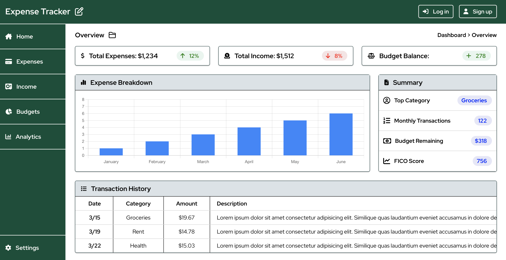

# Expense Tracker

<div align="center">

</div>

## Description

This web application features an informational finance dashboard, which displays data for reported 
income, expenses, and user defined budgets. Users can view a history and breakdown of their expenses 
and income, and create budgets to track their monthly balance. Users can also view charts and 
graphs to viusalize their finances and track trends in their financial habits. Users can create 
an account to upload their financial history, so that they can reliably track the state of their 
finances between sessions and devices.

This project was created to learn more about technologies like Next.js, Docker, Prisma, PostgreSQL, 
GraphQL, SCSS, and Jest. By incorporating these technologies into a comprehensive full-stack 
application, I have been able to learn and practice configuring and connecting all the moving parts 
of the front-end and back-end technologies together. Docker and GraphQL have been the most challenging 
to learn, while incorporating SCSS has been a seamless transition and has proved to be very useful 
and adaptable for creating rulesets and consistency when styling multiple React components.

## Table of Contents

* [Preview](#preview)
* [Installation](#installation)
* [Database](#database)
* [Contributing](#contributing)
* [Technologies](#technologies)
* [License](#license)

## Preview

<div align="center">

</div>

## Installation

To run this application locally, first start the Docker engine on your device, then run the following 
commands to build and run the Docker images using Docker Compose.
```sh
npm run compose:dev:build
npm run compose:dev:up
```
Then visit [http://localhost:3000/](http://localhost:3000/) to view the application in your browser.

## Database
To initialize the PostgreSQL database after starting the Docker Container, run the following 
commands to generate and migrate the database, then seed the database with mock data using FakerJS.
```sh
npm run prisma:dev:generate
npm run prisma:dev:migrate
npm run prisma:dev:seed
```
Visit [http://localhost:3000/api/graphql](http://localhost:3000/api/graphql) to view the Apollo Server Sandbox.

## Contributing


<h3><b>Simon Newton</b></h3>
<hr align=left width=315 />
<p>Full-Stack Web Developer</p>
<a href="https://github.com/simonanewton" target="_blank">GitHub Profile</a> | 
<a href="https://www.linkedin.com/in/simonanewtondev/" target="_blank">LinkedIn Profile</a> | 
<a href="https://developer-portfolio-yqdu.onrender.com" target="_blank">Developer Portfolio</a>

## Technologies

* Next.js
* Docker
* Prisma
* PostgreSQL
* GraphQL
* Apollo Server
* SCSS
* Jest
* FakerJS
* ChartJS
* FontAwesome

## License

[](https://simonanewton.mit-license.org)

MIT License &copy; Simon Newton <https://simonanewton.mit-license.org>
